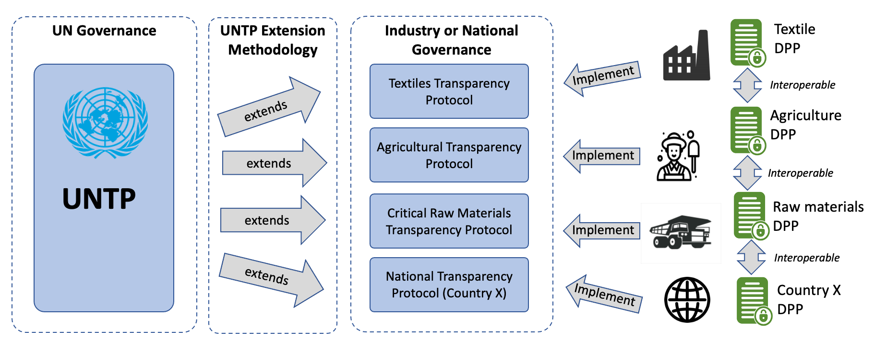

## UNTP 2024 Session 21 Achievements

:::info
Welcome to Pyx biweekly series where we share the latest developments of UNTP around the world.
:::

#### [1. UNTP Extensions Methodology Published](#UNTP-Extensions-Methodology-Published)

#### [2. Transmute Achieves UNTP 0.5 Compliance](#Transmute-Achieves-UNTP-0.5-Compliance)

### UNTP Extensions Methodology Published

In a significant development, the United Nations Trade Platform (UNTP) has released the first draft of the Extensions Methodology designed to enhance the adaptability and interoperability of its core system. This sets the standard to accommodate specific industry and regulatory needs while maintaining seamless cross-industry and cross-border compatibility.
<!-- truncate -->
The updated methodology emphasizes open governance, ensuring that all extensions adhere to transparent processes and remain freely available. It outlines comprehensive guidelines for schema and vocabulary extensions, identifier schemes, and conformity criteria, ensuring alignment with relevant standards and regulations.

From the Article:

> UNTP is designed as a common core that is usable by any industry sector or in any regulatory jurisdiction. This extensions methodology describes how to extend UNTP to meet the specific needs of any industry sector or regulated market in such a way that the extension maintains core interoperability with any other extension. This cross-industry and cross-border interoperability is a core value of UNTP because almost every value chain will cross industry and/or national borders.
> 

Key highlights of the update include the introduction of new schema extensions allowing additional properties to enhance flexibility and the use of JSON-LD @context files to incorporate industry-specific vocabulary. The methodology also details the registration of identifier schemes and the listing of relevant standards and regulations, promoting a robust framework for conformity.

UNTP's commitment to open development is further reinforced through its collaboration with standards bodies such as ISO, ensuring the platform remains aligned with global initiatives. This update is expected to foster greater participation from various industry sectors and national projects, further solidifying UNTP's role as a vital tool for international trade and cooperation.

For more information, stakeholders are encouraged to review the updated methodology and participate in the ongoing development process.  [Visit here for the full details](https://uncefact.github.io/spec-untp/docs/extensions/ExtensionsMethodology/).

Want to talk more about what this all means?  Visit the [Pyx Community Forums](https://forum.pyx.io/) and join in the conversations!

### Transmute Achieves UNTP 0.5 Compliance

In a huge accomplishment, Transmute has been the first solution provider to be marked as UNTP 0.5 Compliant.  Transmute specializes in Regulatory Compliance along the Supply Chain and has integrated VCP (Verifiable Credentials Protocol), DPP (Digital Product Passport), DTE (Digital Traceability Event), and DCC (Digital Conformity Credentials) into their open standard technology.

Congratulations to the Transmute Team!

Visit [here to learn more about Transmute](https://uncefact.github.io/spec-untp/docs/implementations/Software/#transmute).